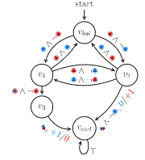

Our Safe and resiLient Autonomous decision-Making (SLAM) group at UND focuses on advancing research in three interrelated areas: 

1. Reinforcement learning driven UAV operations,
2. Autonomous decision making,
3. Resilient autonomous systems. 

We integrate artificial intelligence, formal methods, and optimization techniques to enhance the safety, efficiency, and reliability of autonomous systems.

## Multi-Agent Systems

**[Cooperative Systems](https://www.sciencedirect.com/science/article/pii/S0925231223010974)**

To learn complex temporally extended tasks, we use a reward machine (RM) to encode each agent’s task and expose reward function internal structures.  We propose a decentralized learning algorithm to tackle computational complexity, called decentralized graph-based reinforcement learning using reward machines (DGRM), that equips each agent with a localized policy, allowing agents to make decisions independently based on the information available to the agents. 

<figure>
  
  <!-- <figcaption>Figure: Cooperative control in multi-agent UAV swarms.</figcaption> -->
</figure>

**[Non-Cooperative Systems](https://www.sciencedirect.com/science/article/pii/S092523122400941X)**

We introduce Q-learning with Reward Machines for Stochastic Games (QRM-SG), where RMs are predefined and available to agents. QRM-SG learns each agent’s best-response policy at Nash equilibrium by defining the Q-function in augmented state space that integrates the stochastic game and RM states. The Lemke-Howson method is utilized to compute the best-response policies for the stage game defined by the current Q-functions at each time step. Subsequently, we explore a more challenging scenario where RMs are unavailable and propose Multi-Agent Reinforcement learning with Concurrent High-level knowledge inference (MARCH). MARCH uses automata learning to learn RMs iteratively and combines this process with QRM-SG for learning the best-response policies. 

  <figure style="margin: 0;">
    
    <!-- <figcaption style="text-align: center;">Figure 1</figcaption> -->
  </figure>
  <figure style="margin: 0;">
    
    <!-- <figcaption style="text-align: center;">Figure 2</figcaption> -->
  </figure>

<!-- 

<figure>
  
  <!-- <figcaption>Figure: Cooperative control in multi-agent UAV swarms.</figcaption> -->
<!-- </figure> --> 

## UAV Operations

**[Collision Avoidance](https://ieeexplore.ieee.org/abstract/document/9868001)**

To provide safe and efficient computational guidance of operations for unmanned aircraft, we explore the use of a deep reinforcement learning algorithm based on Proximal Policy Optimization (PPO) to guide autonomous UAS to their destinations while avoiding obstacles through continuous control. The proposed scenario state representation and reward function can map the continuous state space to continuous control for both heading angle and speed.

  <figure style="margin: 0;">
    
    <!-- <figcaption style="text-align: center;">Figure 1</figcaption> -->
  </figure>
  <figure style="margin: 0;">
    
    <!-- <figcaption style="text-align: center;">Figure 2</figcaption> -->
  </figure>

**[Safety Bound](https://arc.aiaa.org/doi/full/10.2514/1.I010786)**

A novel method to determine probabilistic operational safety bound for rotary-wing unmanned aircraft systems
(UAS) traffic management is proposed in this work. The key idea is to combine a deterministic model for rotary-wing
UAS flying distance estimation to avoid conflict and a probabilistic uncertainty quantification methodology to
evaluate the risk level (defined as the probability of failure) of separation loss between UAS. The proposed
methodology results in a dynamic and probabilistic airspace reservation to ensure the safety and efficiency of
future UAS operations. The model includes UAS performance, system updating frequency and accuracy, and weather
conditions. Also, the parameterized probabilistic model includes various uncertainties from different sources and
develops an anisotropic operational safety bound.

  <figure style="margin: 0;">
    
    <!-- <figcaption style="text-align: center;">Bound 1</figcaption> -->
  </figure>
  <figure style="margin: 0;">
    
    <!-- <figcaption style="text-align: center;">Bound 2</figcaption> -->
  </figure>
  <figure style="margin: 0;">
    
    <!-- <figcaption style="text-align: center;">Bound 3</figcaption> -->
  </figure>

## Industrial AI

**[Maintenance Scheduling](https://www.sciencedirect.com/science/article/pii/S0952197621004565)**

A generic model for maintenance scheduling is introduced, in which the maintenance planning is formulated as a Markov Decision Process (MDP) problem and linear optimization problem. A novel Linear Programming enhanced RollouT (LPRT) method is proposed, which is based on linear programming (LP) and rollout. LPRT combines the advantages of two methods and is well-suited to deal with the maintenance scheduling problem with an infinite horizon and stochastic uncertainties. The proposed method is applied to both the deterministic case and the stochastic case.

<figure>
  
  <!-- <figcaption>Figure: Cooperative control in multi-agent UAV swarms.</figcaption> -->
</figure>

**[Integrated Production and Maintenance Scheduling](https://www.sciencedirect.com/science/article/pii/S0360835223006551)**

We propose a novel method called Knowledge Enhanced Reinforcement Learning (KERL), which adopts a centralized multi-agent actor-critic architecture. KERL enhances the performance of Reinforcement Learning (RL) for multi-machine production and maintenance scheduling by leveraging the prior knowledge of the constraint to determine the production decisions and handle the cooperation among machines in the system.

<figure>
  
  <!-- <figcaption>Figure: Cooperative control in multi-agent UAV swarms.</figcaption> -->
</figure>